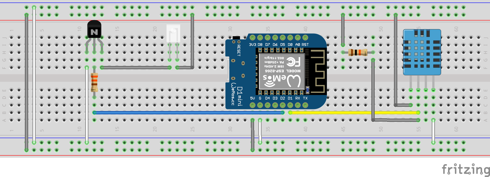

# R2D2-Blaster
 
An IR blaster to control my Mitsubish Airco unit in my Office via MQTT. To have it blend in, I've used a R2D2 USB vacuum cleaner to hide the circuits. The location for the power LED was used to place the IR LED and I've installed a DHT11 temperature sensor at the air vent.
 
 

## Bill of Material
* Wemos D1 Mini
* IR LED 940 nm 5 mm
* DHT11 or DHT22
* 10k Ohm Resistor for DHT11 pull up
* 330 Ohm Resistor for IR LED
* 2N2222A NPN
* R2-D2 Desktop Vacuum
* Wires

## Schematic


## Home Assistant Configuration

To control the airco unit from Home Assistant, i've added the following YAML into my configuration file.

```yaml
- platform: mqtt
  name: Office
  modes:
    - "off"
    - "cool"
    - "heat"
  mode_command_topic: "climate/R2D2/mode/set"
  mode_state_topic: "climate/R2D2/mode/state"
  temperature_command_topic: "climate/R2D2/temperature/set"
  temperature_state_topic: "climate/R2D2/temperature/state"
  current_temperature_topic: "climate/R2D2/temperature/sensor"
  current_temperature_template: "{{ value_json.Temperature }}"
  initial: 21
  max_temp: 31
  min_temp: 16
```
